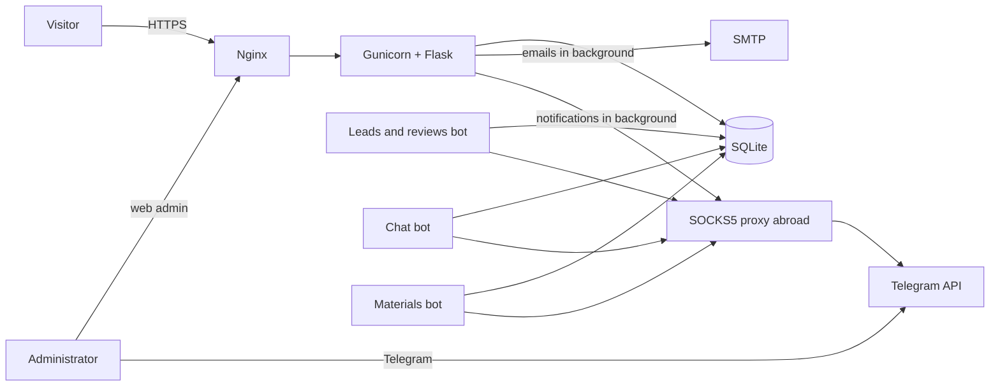

[Русский](README.md) · **English**

# Website for the "Angliyskaya" Bar Association

A corporate website with a lead-handling system for a law firm in Saint Petersburg, Russia: service pages, a quiz, live chat, an ad landing page, a web admin panel and three Telegram bots. Built from scratch, full cycle — from layout to deployment and ongoing support.

**Live site:** [английская.рф](https://xn--80aaiufgeo4bzj.xn--p1ai) (Russian-language)


> The project's source code is closed under the terms of the engagement with the client. This repository contains a description, screenshots of public pages and a few small, generalized snippets. Published as a portfolio piece with the client's consent.

---

## The task

The law firm needed a site that turns a visitor into an inquiry and never loses one: a fast form, instant notifications to the lawyers in a messenger, a backup admin panel in case Telegram misbehaves, and a landing page for paid advertising with source tracking.

## What was built

- **13 service areas and 55 sub-pages**, each with its own SEO copy, meta tags, `sitemap.xml`, `robots.txt` and Open Graph markup.
- **A "get a price range" quiz**: five steps per service area; the result is sent as a lead and opens a deep link to a bot with useful materials.
- **An ad landing page `/consult`**: the headline adapts to the request, UTM tags are stored together with the lead.
- **Live chat on the site** (short polling) answered straight from Telegram: the bot collects name, phone and preferred contact method and shows the lawyer the conversation context.
- **Three Telegram bots**: notifications and review moderation, visitor chat, and a materials bot reached by deep link from the quiz.
- **A web admin panel** as an independent fallback: leads (with an archive of processed ones), reviews with photos, chats with an unread indicator, prices, FAQ, practice examples, team, materials, contacts and legal details. Two access roles.
- **Reviews with photos** with server-side validation: extension whitelist, MIME-type check, size limit.
- **Form protection**: Yandex SmartCaptcha, a honeypot field, rate limiting.
- **Russian legal requirements**: separate consent and privacy-policy documents, plus a separate consent for publishing a review.
- **Analytics**: Yandex Metrika, UTM tracking.

## Stack

| Layer | Technologies |
| --- | --- |
| Backend | Python 3.12, Flask 3, Jinja2, SQLite |
| Frontend | HTML, CSS, vanilla JS — no frameworks |
| Bots | aiogram 3, aiohttp-socks |
| Infrastructure | Gunicorn, Nginx, systemd, Let's Encrypt (HTTP/2) |
| Services | Yandex SmartCaptcha, Yandex Metrika, SOCKS5 proxy (Dante) |

By the numbers: roughly 3,100 lines of Python, 1,000 of JS, 1,300 of CSS and 1,900 of HTML templates.

## Architecture



The site and all three bots share one SQLite database on a single server in Russia, so data is not scattered across machines and personal data stays in the country. A second server abroad does exactly one thing: it proxies requests to Telegram.

## Screenshots

| Services | Service page |
| --- | --- |
|  |  |

| Quiz: question | Quiz: contact and captcha |
| --- | --- |
|  |  |


| Live chat | Mobile | Mobile menu |
| --- | --- | --- |
|  |  |  |

## Interesting engineering problems

### A lead should not wait for notifications

Sending to Telegram through a proxy and by SMTP took seconds and slowed the form response. The visitor does not care about the outcome of those calls, so they run in a background thread and the response returns right after the database write:

```python
app = current_app._get_current_object()

def _notify():
    with app.app_context():
        notify_new_application(...)
        send_application_email(...)

threading.Thread(target=_notify, daemon=True).start()
return jsonify({'success': True})
```

### Telegram from Russia

Direct requests to Telegram are unreliable, so every bot and server-side notification goes through a SOCKS5 proxy on a separate VPS abroad. The proxy is configuration-driven: without the environment variable the bot connects directly, which is convenient for local development.

```python
def make_bot(token: str) -> Bot:
    session = AiohttpSession(proxy=PROXY_URL) if PROXY_URL else None
    return Bot(token=token, session=session)
```

The proxy's firewall accepts the port only from the main server's address.

### Hanging prepositions in Russian text

In Russian typography a short preposition or conjunction must not be left alone at the end of a line. Whatever the screen width, that can only be guaranteed with a non-breaking space, so a small script walks the page's text nodes and glues short words to the next one. The catch: `\b` in JavaScript does not treat Cyrillic as letters, so the word boundary had to be checked with a lookbehind on Unicode properties:

```js
const RE = new RegExp(
  '(?<![\\p{L}\\p{N}])(' + SHORT_WORDS.join('|') + ')[ \\t]+(?=\\S)', 'giu'
);
text.replace(RE, (m, w) => w + ' ');
```

It also has separate rules: a dash sticks to the preceding word, "№" and tax IDs stick to their number, initials stick to the surname.

### HTTPS filtering on routes to Russian data centers

In 2026 the site was intermittently unreachable for some users: the TCP connection to port 443 succeeded, but the TLS handshake hung. Plain HTTP worked, and through a server abroad the site opened instantly. Diagnosis (traces from both ends, comparing HTTP and HTTPS, MTU checks) showed the server was healthy and the problem lay on the network path. What was done:

- HTTP/2 enabled (per reports from other site operators, the filtering reacts to the rate of TLS handshakes, and HTTP/2 multiplexes everything over one connection);
- MSS clamped on the server to rule out a PMTU problem;
- the certificate was moved to automatic renewal over HTTP validation along the way.

The issue is external and intermittent, so the point is not to promise "fixed forever" but to make the site as resilient to it as possible and keep watching availability.

### SmartCaptcha dark theme

The `data-theme` attribute on the captcha container is silently ignored. The theme is only applied through an explicit `render` call with a `theme` parameter. Found by reading the widget's source:

```js
window.smartCaptcha.render(container, {
  sitekey: window.SMARTCAPTCHA_CLIENT_KEY,
  theme: 'dark'
});
```

### Clipped letter tails under an animation

The home headline reveals as a sliding line: a container with `overflow: hidden` acts as the mask. The tails of deep italic letters ("щ", "у", "р") stuck out below the line box and got clipped. `line-height` alone was not enough. The fix: extra room at the bottom inside the mask, offset by a negative `margin-bottom` so the surrounding layout does not shift.

```css
.line-wrap { overflow: hidden; padding-bottom: .6em; margin-bottom: -.6em }
```

### Site icon in Yandex search

The icon did not appear in search results. It turned out `favicon.ico` was not square (a plain downscale of a wide coat of arms), and `sitemap.xml` and `robots.txt` pointed at a domain that was not yet connected. Fixed with a square multi-size `.ico`, PNGs at 120×120 and 192×192, and the domain moved into configuration.

## My role

Design system and layout, backend, admin panel, three bots, integrations (SmartCaptcha, Metrika, email, Telegram), deployment and server setup, network-problem diagnostics, post-launch support.

---

Author: [@burr1t0](https://github.com/burr1t0)
