**Русский** · [English](README.en.md)

# Сайт коллегии адвокатов «Английская»

Корпоративный сайт с системой приёма заявок для юридической коллегии (Санкт-Петербург): страницы услуг, квиз, живой чат, рекламная посадочная, веб-админка и три Telegram-бота. Разработка с нуля, полный цикл — от вёрстки до деплоя и сопровождения.

**Живой сайт:** [английская.рф](https://xn--80aaiufgeo4bzj.xn--p1ai)

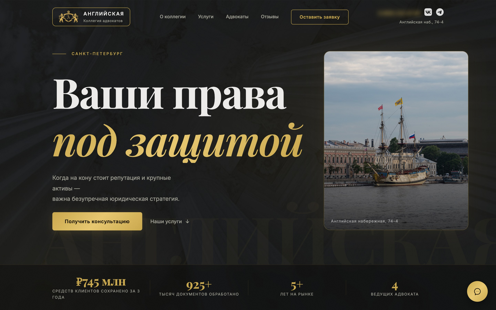

> Исходный код проекта закрыт по условиям работы с заказчиком. В этом репозитории — описание, скриншоты публичных страниц и небольшие обобщённые фрагменты. Публикуется как пример работ с согласия заказчика.

---

## Задача

Юридической коллегии нужен был сайт, который превращает посетителя в заявку и не теряет ни одного обращения: быстрая форма, уведомления адвокатам в мессенджер, резервная админка на случай проблем с Telegram и страница под платную рекламу с отслеживанием источников.

## Что сделано

- **13 направлений услуг и 55 подстраниц** с собственными SEO-текстами, мета-тегами, `sitemap.xml`, `robots.txt`, OG-разметкой.
- **Квиз «узнать вилку стоимости»**: пять шагов под каждое направление, результат уходит заявкой и открывает диплинк на бота с полезными материалами.
- **Рекламная посадочная `/consult`**: заголовок подстраивается под запрос, UTM-метки сохраняются вместе с заявкой.
- **Живой чат на сайте** (short polling) с ответом прямо из Telegram: бот собирает имя, телефон и предпочтительный способ связи и показывает адвокату контекст переписки.
- **Три Telegram-бота**: уведомления и модерация отзывов, чат с посетителями, бот материалов по диплинку из квиза.
- **Веб-админка** как независимый резерв: заявки (с архивом обработанных), отзывы с фото, чаты с индикатором непрочитанного, цены, FAQ, примеры практики, команда, материалы, контакты и реквизиты. Две роли доступа.
- **Отзывы с фото** с серверной проверкой: белый список расширений, проверка MIME-типа, лимит размера.
- **Защита форм**: Яндекс SmartCaptcha, honeypot-поле, ограничение частоты запросов.
- **Требования российского законодательства**: отдельные документы согласия и политики, отдельное согласие на публикацию отзыва.
- **Аналитика**: Яндекс.Метрика, UTM-трекинг.

## Стек

| Слой | Технологии |
| --- | --- |
| Бэкенд | Python 3.12, Flask 3, Jinja2, SQLite |
| Фронтенд | HTML, CSS, vanilla JS без фреймворков |
| Боты | aiogram 3, aiohttp-socks |
| Инфраструктура | Gunicorn, Nginx, systemd, Let's Encrypt (HTTP/2) |
| Сервисы | Яндекс SmartCaptcha, Яндекс.Метрика, SOCKS5-прокси (Dante) |

В цифрах: около 3 100 строк Python, 1 000 JS, 1 300 CSS и 1 900 HTML-шаблонов.

## Архитектура

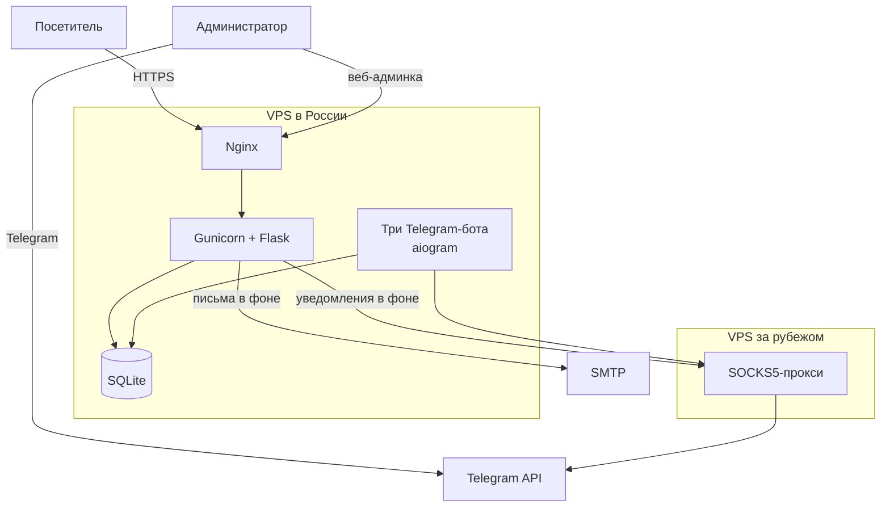

Сайт и три бота работают с одной SQLite на одном российском сервере: так данные не размазываются между машинами, а персональные данные остаются в РФ. Второй сервер за границей выполняет единственную роль — прокси для запросов к Telegram.

## Скриншоты

| Услуги | Страница услуги |
| --- | --- |
| 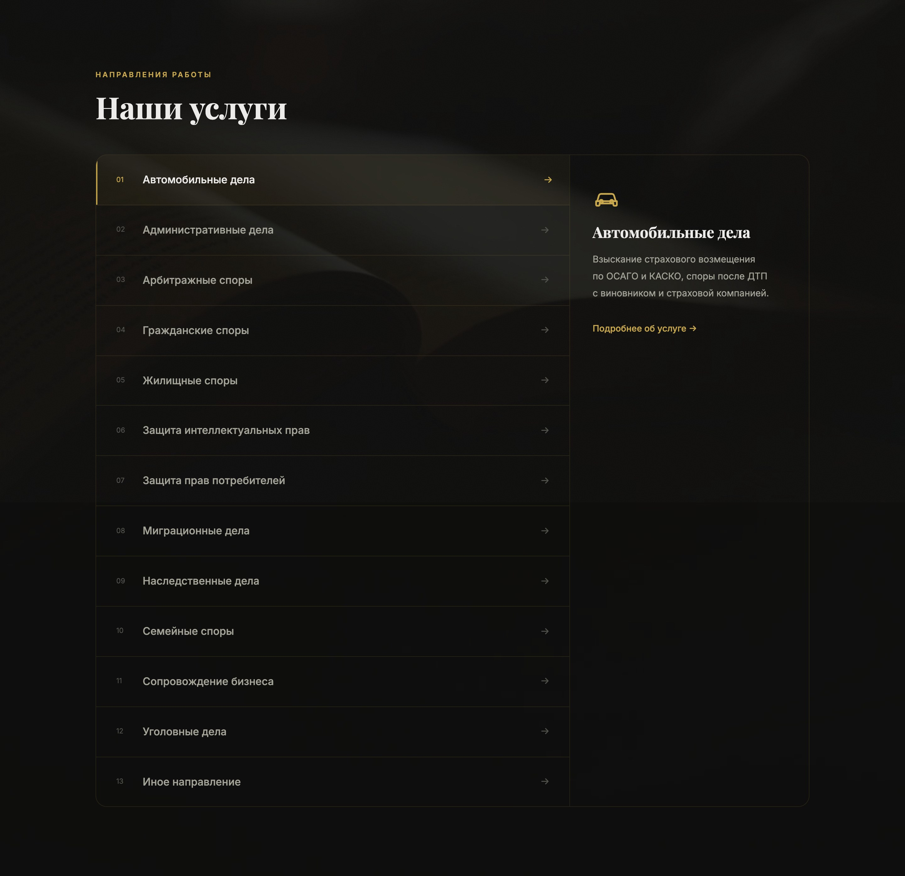 | 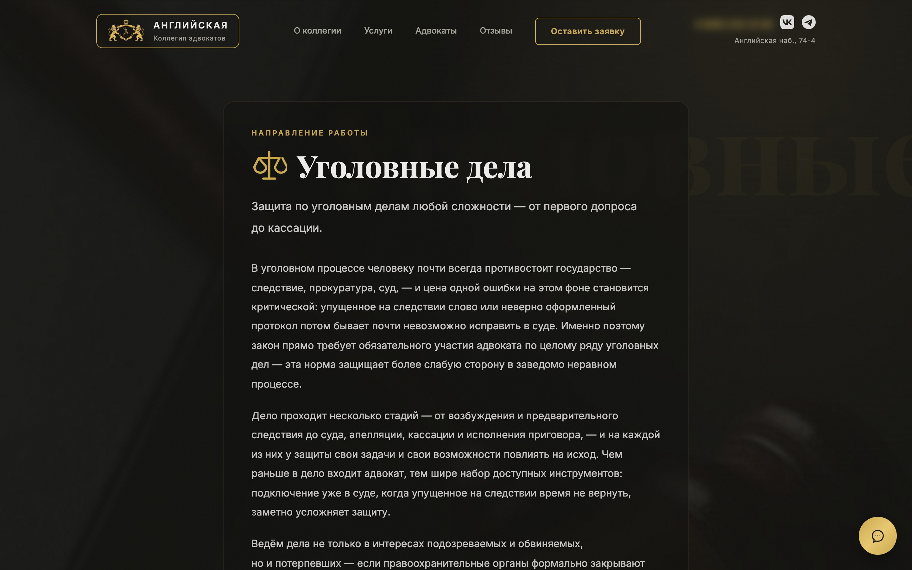 |

| Квиз: вопрос | Квиз: контакты и капча |
| --- | --- |
| 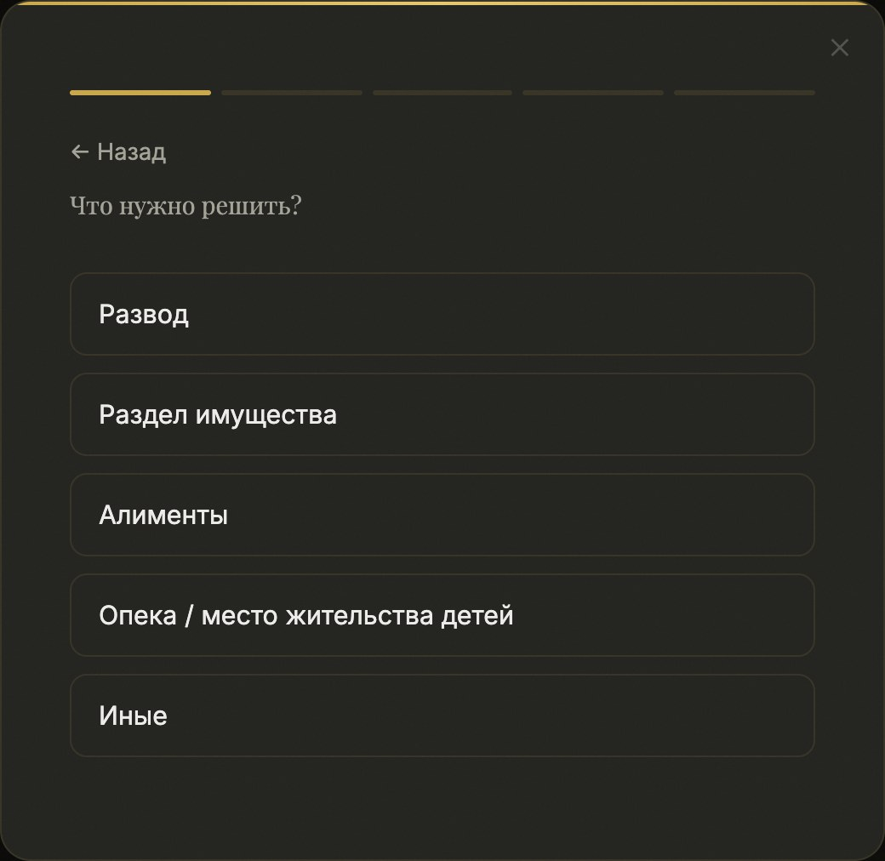 | 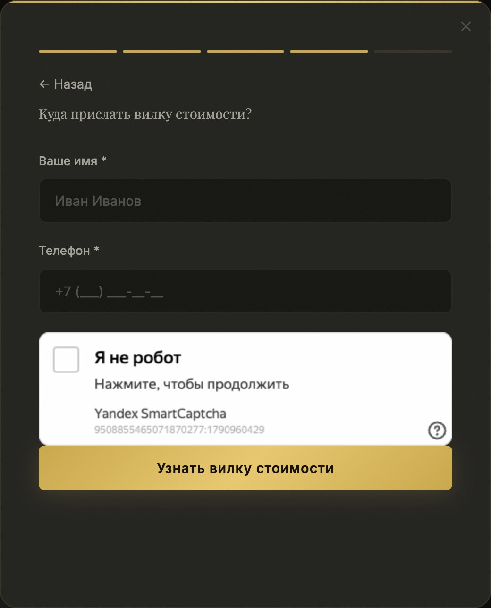 |

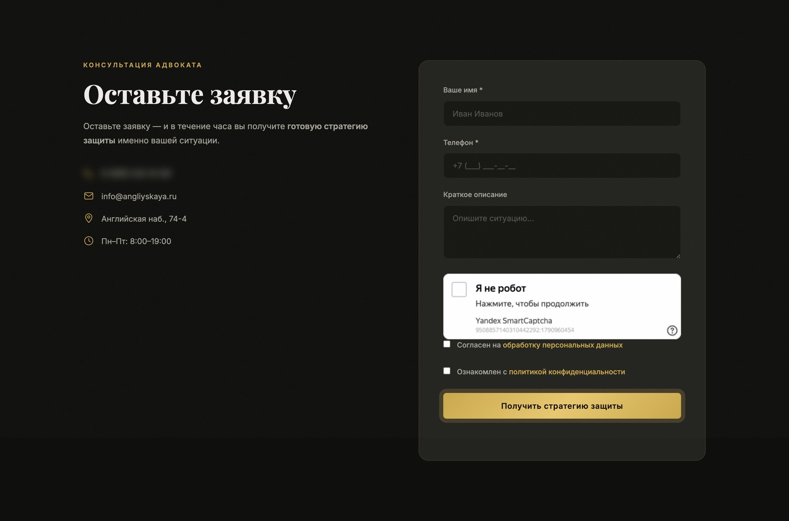

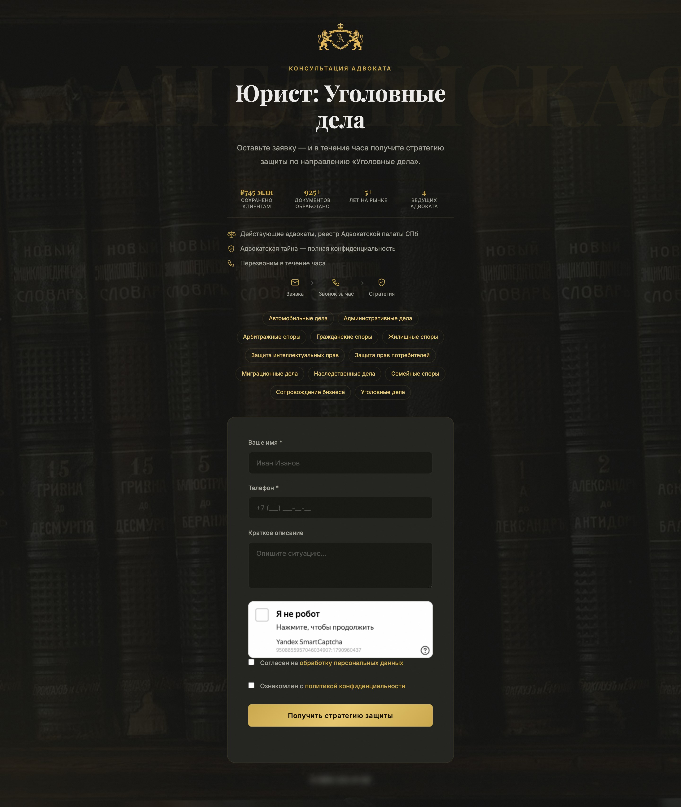

| Живой чат | Мобильная версия | Мобильное меню |
| --- | --- | --- |
| 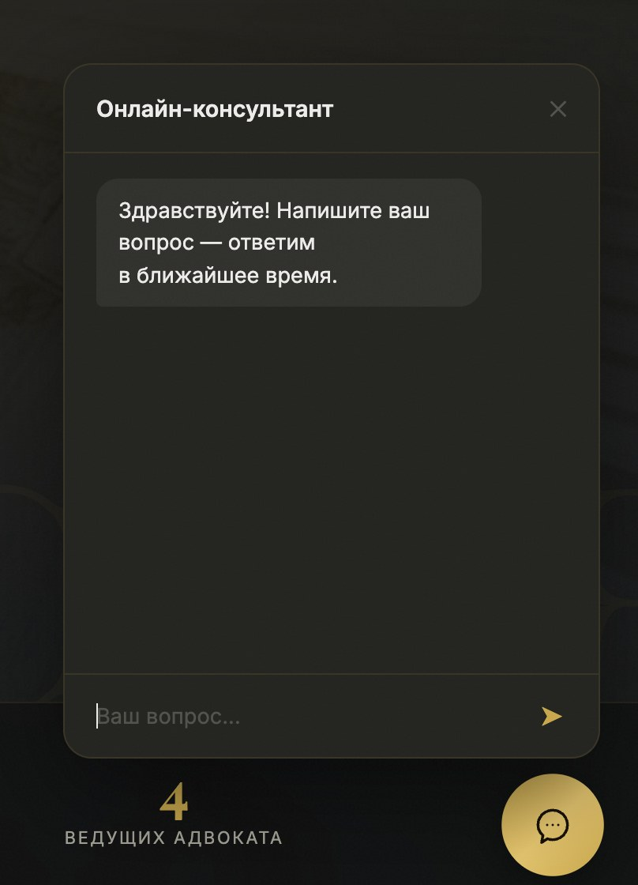 | 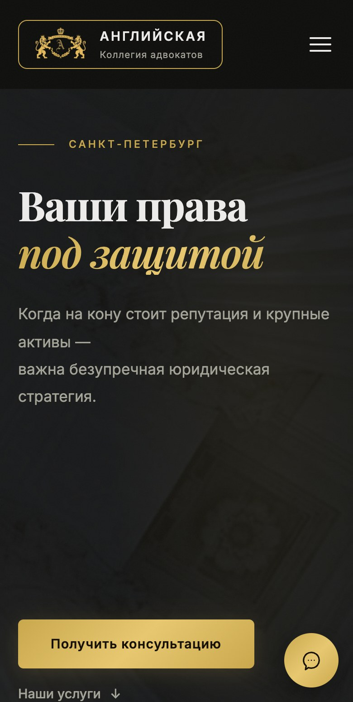 | 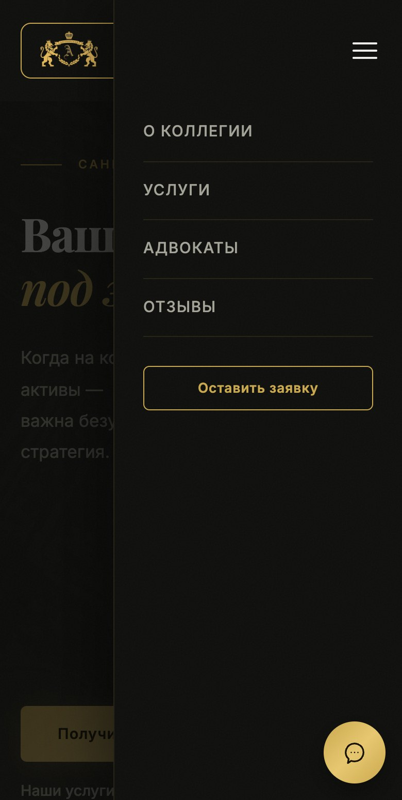 |

## Интересные инженерные задачи

### Заявка не должна ждать уведомлений

Отправка в Telegram через прокси и по SMTP занимала секунды и тормозила ответ формы. Результат этих вызовов посетителю не важен, поэтому они уходят в фоновый поток, а ответ возвращается сразу после записи в БД:

```python
app = current_app._get_current_object()

def _notify():
    with app.app_context():
        notify_new_application(...)
        send_application_email(...)

threading.Thread(target=_notify, daemon=True).start()
return jsonify({'success': True})
```

### Telegram из России

Прямые запросы к Telegram нестабильны, поэтому все боты и серверные уведомления ходят через SOCKS5-прокси на отдельном зарубежном VPS. Прокси выбирается конфигурацией: без переменной окружения бот работает напрямую, что удобно для локальной разработки.

```python
def make_bot(token: str) -> Bot:
    session = AiohttpSession(proxy=PROXY_URL) if PROXY_URL else None
    return Bot(token=token, session=session)
```

Файрвол на прокси пропускает порт только с адреса основного сервера.

### Висячие предлоги в русском тексте

В типографике предлог или союз не должен оставаться в конце строки одним. При любой ширине экрана это можно гарантировать только неразрывным пробелом, поэтому небольшой скрипт проходит по текстовым узлам страницы и приклеивает короткие слова к следующему. Подвох: `\b` в JavaScript не считает кириллицу буквами, поэтому границу слова пришлось проверять через lookbehind с Unicode-свойствами:

```js
const RE = new RegExp(
  '(?<![\\p{L}\\p{N}])(' + SHORT_WORDS.join('|') + ')[ \\t]+(?=\\S)', 'giu'
);
text.replace(RE, (m, w) => w + ' ');
```

Там же отдельные правила: тире клеится к предыдущему слову, «№» и ИНН — к номеру, инициалы — к фамилии.

### Фильтрация HTTPS на маршрутах к российским ЦОД

В 2026 году сайт периодически становился недоступен у части пользователей: TCP-соединение на 443 порт устанавливалось, а TLS-рукопожатие зависало. Обычный HTTP при этом работал, а через сервер за границей сайт открывался мгновенно. Диагностика (трассировки с обеих сторон, сравнение HTTP и HTTPS, проверка MTU) показала, что сервер исправен, а проблема на сетевом пути. Что сделано:

- включён HTTP/2 (по отчётам администраторов других сайтов, фильтрация реагирует на частоту TLS-рукопожатий, а HTTP/2 мультиплексирует всё в одно соединение);
- на сервере ограничен MSS, чтобы исключить проблему с PMTU;
- заодно сертификат переведён на автоматическое продление через HTTP-проверку.

Проблема внешняя и плавающая, поэтому здесь важно не обещать «починено навсегда», а настроить сайт так, чтобы он был к ней максимально устойчив, и следить за доступностью.

### Тёмная тема SmartCaptcha

Атрибут `data-theme` на контейнере капчи молча игнорируется. Тема применяется только при явном вызове `render` с параметром `theme`. Нашлось чтением исходников виджета:

```js
window.smartCaptcha.render(container, {
  sitekey: window.SMARTCAPTCHA_CLIENT_KEY,
  theme: 'dark'
});
```

### Обрезанные хвосты букв под анимацией

Заголовок главной появляется «выезжающей» строкой: контейнер с `overflow: hidden` служит маской. Хвосты глубоких букв курсива («щ», «у», «р») выступали за нижнюю границу строки и обрезались. Одного `line-height` не хватило. Исправление: запас снизу внутри маски с компенсацией отрицательным `margin-bottom`, чтобы вёрстка вокруг не поехала.

```css
.line-wrap { overflow: hidden; padding-bottom: .6em; margin-bottom: -.6em }
```

### Иконка сайта в поиске Яндекса

Иконка не показывалась в выдаче. Оказалось, что `favicon.ico` был не квадратным (получился из широкого герба простым масштабированием), а `sitemap.xml` и `robots.txt` указывали на ещё не подключённый домен. Исправлено: квадратный многоразмерный `.ico`, PNG 120×120 и 192×192, домен вынесен в конфигурацию.

## Что я делал

Дизайн-систему и вёрстку, бэкенд, админку, три бота, интеграции (SmartCaptcha, Метрика, почта, Telegram), деплой и настройку серверов, диагностику сетевых проблем, сопровождение после запуска.

---

Автор: [@burr1t0](https://github.com/burr1t0)
